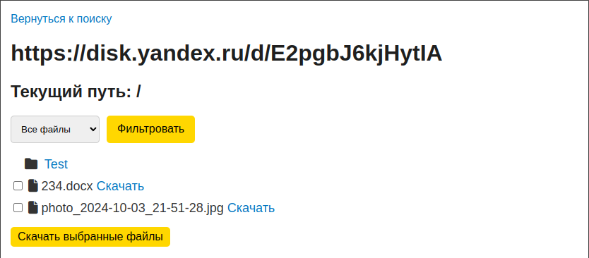
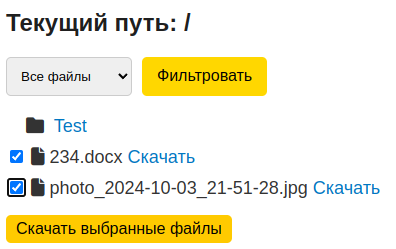

# Flask Yandex Cloud File Storage App

Это приложение Flask позволяет пользователям просматривать и загружать файлы из хранилища Yandex Cloud.


## Возможности

- **Просмотр файлов**: Отображение файлов и папок из хранилища Yandex Cloud.


- **Фильтрация файлов**: Фильтрация файлов по типам (например, изображения, документы и т.д.).

- **Скачивание файлов**: Возможность скачивания отдельных файлов или группы файлов в ZIP-архиве.

- **Кэширование**: Кэширование результатов для ускорения доступа к файлам.
- **Логирование**: Полное логирование событий и ошибок с помощью `loguru`.


## Технологии

- **Flask**: Веб-фреймворк для создания приложения.
- **Yandex Cloud API**: Используется для взаимодействия с хранилищем файлов.
- **aiohttp**: Используется для взаимодействия с Yandex Disk
- **Loguru**: Библиотека для логирования.
- **HTML/CSS**: Для создания пользовательского интерфейса.
- **Docker**(ОПЦИОНАЛЬНО): Для контейнеризации приложения и упрощения развертывания.


## Установка и запуск
Перед запуском приложения необходимо создать файл `.env` в корне проекта. В этом файле нужно задать порт и хост, по которым будет работать приложение.

Пример содержимого файла `.env` можно найти в файле `.env-example`.

#### Пример файла `.env`

```plaintext
PORT=5000
HOST=0.0.0.0
```

## С помощью Docker и docker-compose
Клонирование репозитория
```bash
git clone https://github.com/Tsunami43/YandexCloudAPI.git && cd YandexCloudAPI
```
Запуск контейнера через docker-compose
```bash
sudo docker-compose  up -d --build
```

### Стандартный запуск
Клонирование репозитория
```bash
git clone https://github.com/Tsunami43/YandexCloudAPI.git && cd YandexCloudAPI
```
Установка зависимостей
```bash
pip install -r requirements.txt
```
Запуск скрипта
```bash
python main.py
```
